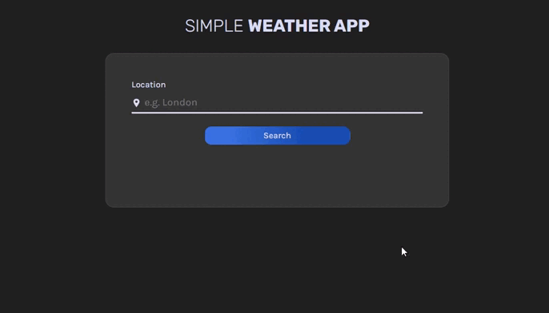

# SIMPLE WEATHER APP

<h3>
<a  href="https://simple-weather-app-yv.netlify.app/">Live</a>

## Preview

## Challenge's description

This project has been done to put into practice the knowledge I've been acquiring through React's study. I've used [Open Weather API](https://openweathermap.org/api) to get the weather data.

There is a problem with API's request. To get the needed information, it's required to make two different requests:

1. Request to [Current Weather Data API](https://openweathermap.org/current) in order just to get the geographical coordinates of the city.

2. Request to [One Call API](https://openweathermap.org/api/one-call-api) using the coordinates to get further information.

The second API database is smaller than the first one so it doesn't contain as many cities as the first API. If you type a location that the second API database doesn't contain but the first one does, you won't get an error message. Nonetheless, the desire data of the city you search will be impossible to get. Instead, because of the geographical coordinates that you obtained in the first place, the 'One Call API' will return the weather data of another city, this being the closest city to the forementioned coordinates in this database.

> E.g.: If you type 'Barcelona', you'll get Madrid's information since Barcelona's data is only in the first request but not in the second one. Madrid is in both databases and it's the closest city to Barcelona's coordinates.

## Features

- Loading spinner used is from [loader](https://vineethtrv.github.io/loader/)
